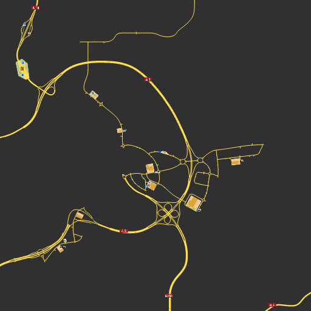

# TS Map - Map renderer
#### Euro Truck Simulator 2 and American Truck Simulator

## About

This project are written on C#. This app are used to exctact datas from the game file and export as Json files or Png files

The main purpose about it, it's the map extraction. It's can create image of the game map.

You can use it on the opensource map like OpenLayer.

It's made for SCS Software game, especially Euro Truck Simulator 2 and American Truck Simulator

## What's can do ?

This project can: 

- Read the SCS files
- Extract POI( Ferry connexion, companies, route name, etc... )
- Extract cities list and position
- Generate map tiles

### Map available

|Map|Game|Version|Release|
|---|---|---|---|
|Base|Euro Truck Simulator 2|v1.40.3.3|N/A|
|Base|American Truck Simulator *|v1.40.3.3|N/A|
|Promod|Euro Truck Simulator 2 *|v2.50|N/A|
|Promod Canada|American Truck Simulator *|v2.50|N/A|

> *The tested mods load and get drawn but I haven't looked at anything specific so it's always possible there will be some items missing or things will get drawn that shouldn't.

### DLC Supported

|Game|Name|Release|
|---|---|---|
|Going East|Euro Truck Simulator 2|N/A|
|Scandinavia|Euro Truck Simulator 2|N/A|
|Vive La France|Euro Truck Simulator 2|N/A|
|Italia|Euro Truck Simulator 2|N/A|
|Beyond the Baltic Sea|Euro Truck Simulator 2|N/A|
|Road to the Black Sea|Euro Truck Simulator 2|N/A|
|Arizona|American Truck Simulator|N/A|
|New Mexico|American Truck Simulator|N/A|
|Oregon|American Truck Simulator|N/A|
|Washington|American Truck Simulator|N/A|
|Utah|American Truck Simulator|N/A|
|Colorado|American Truck Simulator|N/A|

#### Dependencies (NuGet)
- [DotNetZip](https://www.nuget.org/packages/DotNetZip/)
- [Newtonsoft.Json](https://www.nuget.org/packages/Newtonsoft.Json)

#### Based on
Fork of [dariowouters/ts-map](https://github.com/dariowouters/ts-map)

## License
Under the [MIT License](LICENSE)

© JAGFx - hey@emmanuel-smith.me
