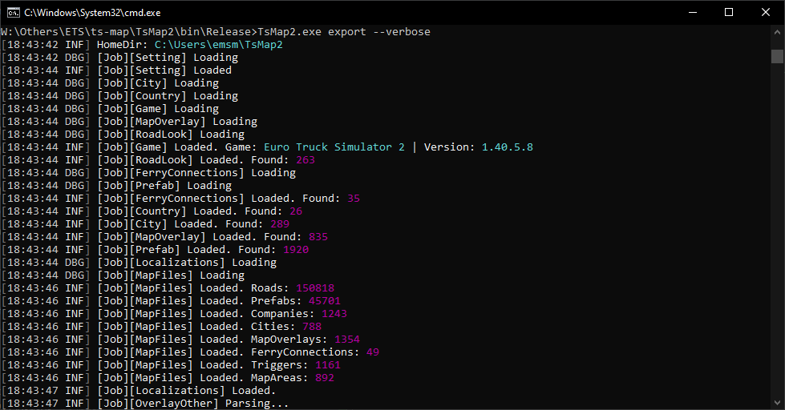

# TS Map - Map renderer
#### Euro Truck Simulator 2 and American Truck Simulator

[](https://github.com/JAGFx/ts-map/releases/latest)
[](https://github.com/JAGFx/ts-map/releases)
[](https://github.com/JAGFx/ts-map/releases/latest)
[](https://github.com/JAGFx/ts-map/blob/master/README.md)
[](https://github.com/JAGFx/ts-map/releases/latest)
[](https://discord.gg/8abqrEeFxF)

## About

This project are written on C#. This app are used to exctact datas from the game file and export as Json files or Png files

The main purpose about it, it's the map extraction. It's can create image of the game map.

You can use it on the opensource map like OpenLayer.

It's made for SCS Software game, especially Euro Truck Simulator 2 and American Truck Simulator

I'm decide to rework full original project. Now you can use it from a console and soon from a new graphical interface.




## How to use ?

### Console

- Step 1: [Download](https://github.com/JAGFx/ts-map/releases/tag/v1.0.0-cli-beta) and extract the archive on your desktop
- Step 2: Open a Windows console
- Step 3: Generate a setting file: `TsMap2.exe export -s`
- Step 4: Follow instructions
- Step 5: Export map tiles: `TsMap2.exe export`

If you need help on the console usage, type `TsMap2.exe -h`

#### Settings file

This file is required to export map tiles. Please be sure to create it before the map tiles generation.

If you want to include mods, add in settings files absolutes path to all `*.scs` mod file

Default settings file: 
````json
{
  "AtsPath": "C:\\Games\\Steam\\steamapps\\common\\American Truck Simulator",
  "Ets2Path": "C:\\Games\\Steam\\steamapps\\common\\Euro Truck Simulator 2",
  "ExportSettings": {
    "ExportType": 1,
    "TilePadding": 384,
    "TileSize": 512,
    "TileZoomMax": 8,
    "TileZoomMin": 0
  },
  "FallbackGame": "ets2",
  "MapColor": {
    "Background": "#303030",
    "CityName": "#DEDEDE",
    "Error": "#303030",
    "FerryLines": "#FFFFFF",
    "PrefabDark": "#E1A338",
    "PrefabGreen": "#AACB96",
    "PrefabLight": "#ECCB99",
    "PrefabRoad": "#FFDC50",
    "Road": "#FFDC50"
  },
  "OutputPath": "C:\\Users\\myName\\TsMap2\\Output",
  "RenderFlags": 2147483647,
  "SelectedLocalization": "",
  "Mods": []
}
````


## What's can do ?

This project can: 

- Read the SCS files
- Extract POI( Ferry connexion, companies, route name, etc... )
- Extract cities list and position
- Generate map tiles    
- Generate geojson file for cities

### Map available

|Map|Game|Version|Release|
|---|---|---|---|
|Base|Euro Truck Simulator 2|v1.40.3.25|[Download](https://github.com/JAGFx/ts-map/releases/download/v0.10/jagfx-map-ets2.tar.gz)|
|Base|American Truck Simulator *|v1.40.3.3|Not enough DLC|
|Promod|Euro Truck Simulator 2 *|v2.55|[Download](https://github.com/JAGFx/ts-map/releases/download/v0.10/jagfx-map-promod.tar.gz)|
|Promod Canada|American Truck Simulator *|v1.0.1|Not enough DLC|

> *The tested mods load and get drawn but I haven't looked at anything specific so it's always possible there will be some items missing or things will get drawn that shouldn't.

### DLC Supported

|Game|Name|Release|
|---|---|---|
|Going East|Euro Truck Simulator 2|v0.10|
|Scandinavia|Euro Truck Simulator 2|v0.10|
|Vive La France|Euro Truck Simulator 2|v0.10|
|Italia|Euro Truck Simulator 2|v0.10|
|Beyond the Baltic Sea|Euro Truck Simulator 2|v0.10|
|Road to the Black Sea|Euro Truck Simulator 2|v0.10|
|Arizona|American Truck Simulator|N/A|
|New Mexico|American Truck Simulator|N/A|
|Oregon|American Truck Simulator|N/A|
|Washington|American Truck Simulator|N/A|
|Utah|American Truck Simulator|N/A|
|Colorado|American Truck Simulator|N/A|


#### Dependencies (NuGet)
- [DotNetZip](https://www.nuget.org/packages/DotNetZip/)
- [Newtonsoft.Json](https://www.nuget.org/packages/Newtonsoft.Json)

#### Based on
Fork of [dariowouters/ts-map](https://github.com/dariowouters/ts-map)

## License
Under the [MIT License](LICENSE)

© JAGFx - hey@emmanuel-smith.me
